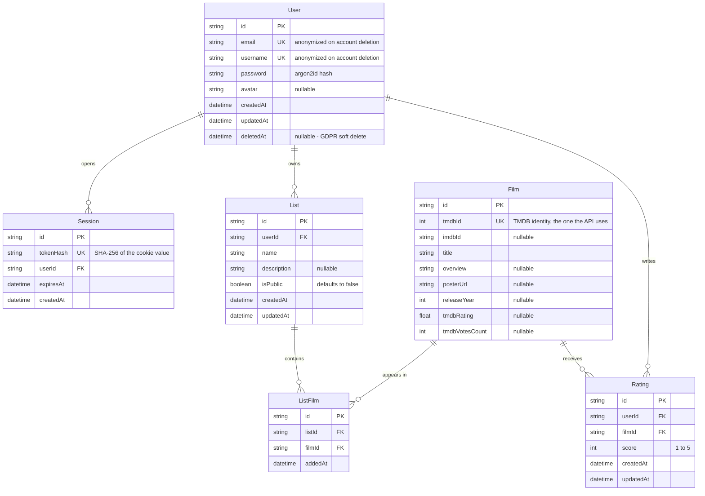

# Popcorn Library


Film discovery platform. Search movies through the TMDB API, build personal lists, and rate films.

**Stack:** React · TypeScript · Express · PostgreSQL · Prisma · Docker

## Tech stack

**Frontend** — React 19, TypeScript, React Router v7, Zustand, React Hook Form + Zod, SCSS Modules, Vite

**Backend** — Node.js, Express 5, TypeScript, Prisma, PostgreSQL

**Infra** — Docker, Nginx (reverse proxy), GitHub Actions

## Architecture

The backend uses a layered architecture, each layer with a single responsibility:

```
routes → controllers → services → repositories  (internal database)
                                 └→ clients      (external APIs, e.g. TMDB)
```

- **Controllers** orchestrate the request/response; they contain no business logic.
- **Services** hold the business logic.
- **Repositories** are the only layer allowed to use Prisma.
- **Clients** are the only layer allowed to call third-party APIs.

### Key decisions

- **Opaque session tokens, not JWT.** A random token is stored raw in an httpOnly cookie and SHA-256 hashed in the database. Every request validates the session against the DB (which also enforces soft-deleted accounts), so the stateless advantage of a JWT would be lost anyway.
- **Password hashing with argon2id** (OWASP recommendation).
- **GDPR-friendly account deletion.** Deleting an account anonymizes the record (email, username, password, avatar) and sets `deletedAt`, instead of removing the row.
- **Lazy film persistence.** Films from TMDB are written to the database only the first time a user rates or adds one to a list.
- **Validation and errors.** Zod validates every request body; a custom error hierarchy is serialized by a single global error handler into a consistent `{ error, message }` response.

## Data model

Six tables. `ListFilm` is an explicit join table rather than an implicit
many-to-many relation, because a film's membership in a list carries data of its
own (`addedAt`).



Three constraints carry the modelling decisions, and none of them are expressible
in the diagram above:

- **`@@unique([userId, filmId])` on `Rating`** — a user rates a given film once.
  Re-rating updates the existing row; rating the same score again deletes it.
- **`@@unique([listId, filmId])` on `ListFilm`** — the same film cannot be added
  twice to one list. The database enforces it, so the API returns `409` instead
  of relying on a check-then-insert race.
- **`Film` rows are created lazily** — a film is only persisted the first time
  someone rates it or adds it to a list. Everything else is served straight from
  TMDB, so the table stays a cache of what users actually engaged with.

Every foreign key is indexed (`@@index`), and all relations use Prisma's default
`RESTRICT` delete behaviour: cleanup order is explicit in the service layer,
inside a transaction, rather than delegated to cascading deletes.

## Known limitations

Deliberate MVP trade-offs — shipping a deployed product first, at a scale where these are harmless:

- **No pagination.** Three endpoints return a single batch of results:
  - film search only surfaces the first page from TMDB (20 results);
  - `GET /api/lists` returns every public list in the database;
  - `GET /api/films/:tmdbId/ratings` returns every rating for a film.

  The planned fix is a validated `?page=` query param, `take`/`skip` at the repository layer, a `totalCount` in the responses, and pagination controls in the UI.

## Getting started

Requirements: Node 24+, Docker.

### Run everything in Docker

The whole stack (PostgreSQL, backend, frontend, Nginx reverse proxy) is containerized:

```bash
cp .env.example .env                   # PostgreSQL credentials used by Docker Compose
cp backend/.env.example backend/.env   # fill in the values, including your TMDB access token
docker compose up -d                   # http://localhost
```

Migrations run automatically when the backend container starts.

### Local development

Only the database runs in Docker; both apps run with hot reload:

```bash
# 1. Start PostgreSQL
cp .env.example .env        # PostgreSQL credentials used by Docker Compose
cp docker-compose.override.yml.example docker-compose.override.yml  # exposes Postgres on localhost:5433 (dev only)
docker compose up -d db

# 2. Backend
cd backend
cp .env.example .env        # fill in the values, including your TMDB access token
npm install
npx prisma migrate dev
npm run dev                 # http://localhost:3000

# 3. Frontend (in a second terminal)
cd frontend
cp .env.example .env
npm install
npm run dev                 # http://localhost:5173
```

In development the frontend proxies `/api` requests to the backend, so both run side by side.

## Road to MVP

- ✅ Project setup (folder structure, Prisma schema, Dockerized PostgreSQL)
- ✅ Auth API (register, login, logout, session middleware)
- ✅ Films API (TMDB search + film detail)
- ✅ Lists API (full CRUD + add/remove films)
- ✅ Ratings API (create, update, delete, ratings per film)
- ✅ Frontend (search, film detail, lists, ratings, public profiles, settings)
- ✅ CI (GitHub Actions — lint, build and unit tests for both apps)
- ✅ Full containerization + Nginx reverse proxy
- ⬜ Deployment (VPS)
